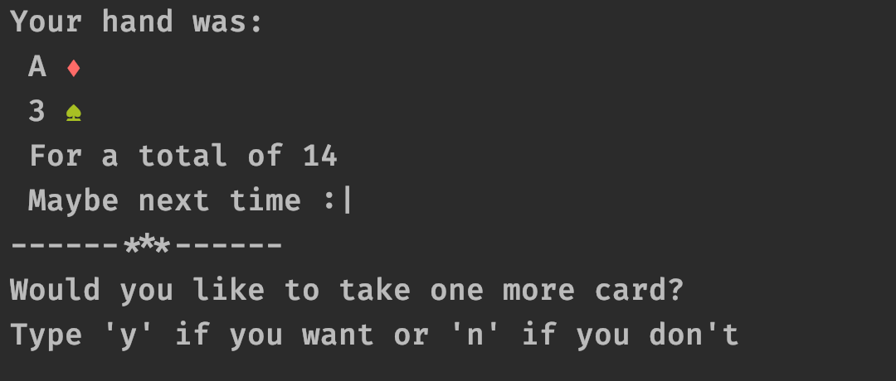

# Blackjack

## Project description:

Blackjack is a game played with regular playing cards.
Playing cards consist of a ‘pip’, the numeric or face value of the card, and a suit.
The player receives two cards initially and the goal of the game is for the cards’ pip total to equal and not exceed 21. 

## Flow description

 - Run main function and initialize the game!
 - You can decide if play one more time by typing 'y' or 'n' :)

 
 
 - One more thing: I added a test package with some testing functions; I hope to improve this part with a little of feedback.
 
 ## References: 
 
  - Add testing libraries [Here](https://www.jetbrains.com/help/idea/configuring-testing-libraries.html)